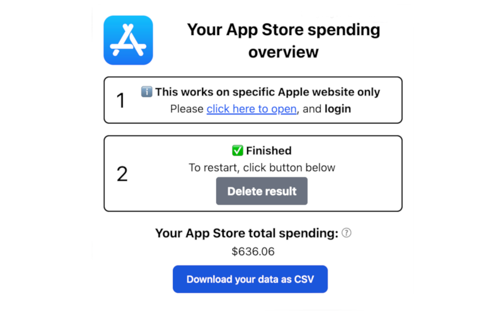

# How much have I spent on App Store?

This is a Google Chrome extension that calculates how much you have spent on App Store.

[View it on Chrome web store](https://chromewebstore.google.com/detail/how-much-did-i-spent-on-a/bgdecjabbhjkhenadhghpkkabmjdhhag?hl=en) and try it out.

## How to install

This extension has been published to Chrome web store. You can [get it here](https://chromewebstore.google.com/detail/how-much-did-i-spent-on-a/bgdecjabbhjkhenadhghpkkabmjdhhag?hl=en) if you are using Chrome browser.

### Manual installation

If you wish to install it using "Load Unpacked" feature in Chrome, you can do so by following the section "Manual Install" [here](./CONTRIBUTION.md).

## How to use

TODO
